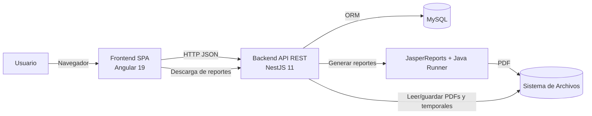
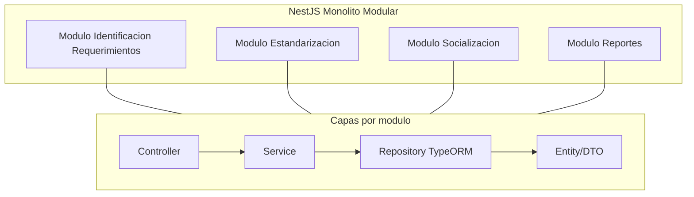

# Diseno de Arquitectura del Sistema Estandarizacion

## 1) Tipo de arquitectura identificada

El sistema implementa una arquitectura **cliente-servidor** con estas caracteristicas:

- **Frontend SPA (Angular 19)** en `frontend/src/app`
- **Backend API REST (NestJS 11)** en `backend/src`
- **Persistencia relacional (MySQL + TypeORM)** configurada en `backend/src/app.module.ts`
- **Monolito modular en backend**: un solo despliegue/proceso, separado por modulos de dominio

En terminos de estilo, el backend combina:

- **Monolito modular**
- **Arquitectura en capas** (`controller -> service -> repository/entity`)
- **Organizacion por dominio** (procedimientos, estandarizacion, socializacion)

## 2) Evidencias tecnicas del repositorio

- `backend/src/main.ts`: expone API HTTP en puerto `3000`, habilita CORS para Angular (`http://localhost:4200`) y usa `ValidationPipe`.
- `backend/src/app.module.ts`: levanta TypeORM con MySQL y registra todos los modulos funcionales.
- `backend/src/modules/**`: cada dominio tiene controlador, servicio, DTOs y entidades.
- `frontend/src/app/app.routes.ts`: SPA con rutas por funcionalidades.
- `frontend/src/app/modules/**/services/*.service.ts`: consumo de API REST con `HttpClient`.

## 3) Por que tu sistema tiene esta arquitectura

Tu sistema encaja en este tipo de arquitectura por estas razones concretas:

1. **Separacion de responsabilidades clara**
- La UI y la logica de negocio estan desacopladas en dos aplicaciones distintas (Angular/Nest).

2. **Dominio funcional bien delimitado**
- El backend organiza el negocio por modulos que representan el flujo real: identificacion, estandarizacion y socializacion.

3. **Complejidad manejable para una sola aplicacion**
- No hay indicios de necesidades de microservicios (cola de eventos, despliegues independientes por dominio, scaling por servicio).  
- Un monolito modular reduce costo operativo y acelera cambios.

4. **Flujo de datos coherente con CRUD + procesos documentales**
- REST + MySQL + TypeORM cubren bien el caso de uso principal.
- El backend agrega integraciones especializadas para PDF/reportes (Jasper y `pdf-lib`) sin romper el estilo general.

## 4) Diseno de arquitectura (vista de contenedores)

## 5) Diseno interno del backend (monolito modular)

## 6) Mapa funcional recomendado de modulos

- **Identificacion de requerimientos**
- Gestion CRUD de procedimientos.
- Punto de entrada del ciclo de estandarizacion.

- **Estandarizacion**
- Estados del procedimiento: documento soporte, soporte computacional, reglamento.
- Subcomponentes: reglamento base, formulario DAAC, diagrama de flujo.

- **Socializacion**
- Registro y gestion de socializacion del procedimiento.
- Union de documentos PDF para salida final.

- **Reportes**
- Orquestacion de datos + render de PDF con Jasper.

## 7) Decisiones de arquitectura recomendadas (siguiente nivel)

Si quieres consolidar este diseno y hacerlo mas mantenible:

1. Centralizar configuracion (`.env`) para host, credenciales, rutas y CORS.
2. Agregar capa de **application/use-cases** para separar reglas de negocio de infraestructura pesada (archivos/Jasper).
3. Estandarizar contratos API con versionado (`/api/v1/...`) y manejo de errores uniforme.
4. Definir limites explicitos entre modulos (evitar dependencias cruzadas innecesarias).
5. Preparar infraestructura para despliegue por ambientes (dev/test/prod) sin rutas locales fijas.

